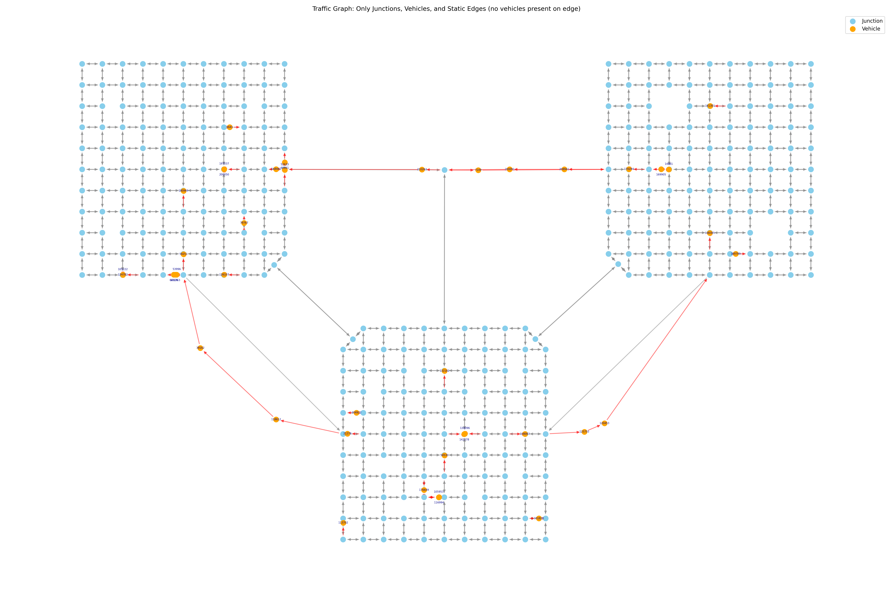

# Traffic-DSTG-Gen

**Dynamic Spatio-Temporal Graph Generator for Traffic Simulation Data**


---

**Traffic-DSTG-Gen** is an open-source tool for generating dynamic, spatio-temporal graph datasets from urban traffic simulations. It is designed for research and development in traffic forecasting, intelligent transportation systems, and machine learning—especially graph neural networks (GNNs).

This toolkit integrates with SUMO (Simulation of Urban Mobility) and supports user-defined scenarios, including complex urban environments with multiple traffic zones and **explicit route awareness** for accurate ETA prediction.

---

## 🚀 Key Features

- **Dynamic Graph Generation**  
  Converts traffic simulation data into dynamic, spatio-temporal graphs with both vehicles and junctions as nodes.

- **Route-Aware Dataset**  
  **First-of-its-kind** dataset that explicitly incorporates user route intentions alongside traffic state information.

- **Multi-Relational Graph Structure**  
  Supports multiple edge types: static roads, junction-vehicle, vehicle-vehicle, and vehicle-junction relationships.

- **Temporal Processing**  
  Processes historical snapshots (30-snapshot windows) for temporal analysis and model training.

- **PyTorch Geometric Compatibility**  
  Exports datasets ready for modern GNN frameworks with comprehensive feature engineering.

- **Comprehensive EDA Tools**  
  Built-in exploratory data analysis with memory-efficient processing for large datasets.

---

## 🎯 Novelty: Route-Aware Dynamic Graph Construction

A key innovation of **Traffic-DSTG-Gen** is the representation of **dynamic traffic states as graphs where both junctions *and* vehicles are nodes**, combined with **explicit route awareness**:

- **Junctions** (blue nodes): Represent intersections with traffic state information
- **Vehicles** (orange nodes): Represent every vehicle with complete route information
- **Static edges** (grey): Represent road network connectivity
- **Dynamic edges** (red): Real-time vehicle relationships based on current positions
- **Route edges**: Explicit encoding of remaining route paths for each vehicle

This enables **route-aware ETA prediction** where models can leverage both current traffic conditions and intended travel paths.



*Above: Example snapshot showing route-aware dynamic graph structure. Orange nodes = vehicles, blue nodes = junctions. Red chains = vehicle relationships, with explicit route information.*

---

## 🏙️ Simulation Scenario: Urban Three-Zone Network

The provided `urban_three_zones.net.xml` network models a realistic city environment with:

- **Zone A:** Residential area with parks and attractions
- **Zone B:** Commercial center and work destinations  
- **Zone C:** Mixed residential with stadiums and entertainment venues
- **Zone H:** Highway connections (if applicable)

### Traffic Patterns
- **Morning Rush**: 6:30-9:30 (A,C → work)
- **Evening Rush**: 16:00-19:00 (work → home)
- **Lunch Break**: 12:00-13:30 (work → restaurants)
- **Social/Leisure**: 19:00-23:00 (home → parks/stadiums)
- **Weekend Events**: Stadium events (Saturday), Park events (Sunday)

### Dataset Scale
- **Simulation Duration**: 4 weeks
- **Journeys per Week**: ~231,909 journeys
- **Total Journeys**: ~927,636 journeys
- **Snapshot Interval**: 30 seconds
- **Total Snapshots**: ~80,640 snapshots

### Temporal Split
- **Training**: Weeks 1-2 (2 weeks)
- **Validation**: Week 3 (1 week)
- **Test**: Week 4 (1 week)

---

## 🛠️ Getting Started

### 1. Clone the repository

```bash
git clone https://github.com/Ruppin-SmartTransportation/Traffic-DSTG-Gen.git
cd Traffic-DSTG-Gen
```

### 2. Set up the environment

It is **strongly recommended** to use a Python virtual environment.

```bash
python -m venv venv
source venv/bin/activate  # (or venv\Scripts\activate on Windows)
```

### 3. Install dependencies

All dependencies (with pinned versions for reproducibility) are listed in `requirements.txt`.

```bash
pip install -r requirements.txt
```

**Required versions:**
```
matplotlib==3.7.5
pandas==2.0.3
psutil==5.9.5
sumolib==1.22.0
torch==2.4.1+cu121
torch_geometric==2.6.1
tqdm==4.67.1
traci==1.22.0
```

> **Note:**  
> - Ensure [SUMO](https://sumo.dlr.de/docs/Downloads.php) (version 1.22.0) is installed and available on your system PATH.
> - CUDA-enabled PyTorch (`torch==2.4.1+cu121`) is recommended for GPU acceleration.

---

## 📁 Project Structure

```
Traffic-DSTG-Gen/
├── main.py                          # Entrypoint: simulation control & graph generation
├── simulation.config.json           # Global config for zones, vehicles, intervals
├── simulation.config.2weeks.json    # 2-week simulation config
├── simulation.config.week.json      # 1-week simulation config

├── graph/
│   ├── __init__.py
│   └── entities.py                  # Classes for graph node/edge abstractions

├── simulation/
│   ├── __init__.py
│   ├── *.txt                       # Zone-specific traffic sources (parks, stadiums)
│   ├── urban_three_zones.net.xml   # SUMO network file
│   ├── urban_three_zones.sumocfg   # SUMO simulation config
│   ├── vehicle_types.add.xml       # Vehicle type definitions
│   └── view_settings.xml           # SUMO GUI visual config

├── tools/
│   ├── dataset_creator.py          # Main dataset conversion tool (NEW)
│   ├── create_labels_json.py       # Per-snapshot label generation
│   ├── EDA.py                      # Comprehensive EDA toolkit
│   ├── pt_validation.py            # .pt file validation
│   ├── visualize_graph.py          # Graph visualization tools
│   ├── analyze_snapshot.py         # Snapshot analysis utilities
│   ├── validate_labels.py          # Label validation
│   └── dataset_restorer.py         # Dataset restoration tools

├── eda_exports/                    # EDA outputs (generated during analysis)
│   ├── mappings/                   # ID mapping files
│   ├── eta/                        # ETA analysis results
│   └── *.csv, *.png, *.json        # Feature summaries and visualizations

├── logs/                           # Simulation and processing logs
├── requirements.txt
├── LICENSE
└── README.md
```

---

## 🔄 Complete Dataset Preparation Workflow

This project includes a comprehensive 5-step pipeline to transform SUMO simulation output into clean, GNN-ready `.pt` graph files:

### 1. **[Simulation]** Generate Traffic Snapshots

```bash
python main.py --config simulation.config.json --sumo-gui
```

**Outputs:**
- `step_XXXXXX.json` - Traffic snapshots (every 30 seconds)
- `labels.json` - Global ground truth ETA labels
- `eda_exports/mappings/` - ID mapping files

### 2. **[Labeling]** Generate Per-Snapshot Labels

```bash
python tools/create_labels_json.py \
  --snapshots_folder traffic_data \
  --gt_labels_path traffic_data/labels.json \
  --output_labels_folder traffic_data/labels
```

**Outputs:**
- `labels_XXXXXX.json` - Per-snapshot ETA labels

### 3. **[EDA]** Generate Feature Statistics

```bash
python tools/EDA.py --snapshots_folder traffic_data
```

**Outputs:**
- `vehicle_feature_summary.csv` - Vehicle feature statistics
- `junction_feature_summary.csv` - Junction feature statistics  
- `edge_feature_summary.csv` - Edge feature statistics
- `labels_feature_summary.csv` - Label feature statistics
- `eta_analysis_*.csv` - ETA category analysis
- `*.png` - Feature distribution plots

### 4. **[Conversion]** Convert to PyTorch Geometric Format

```bash
python tools/dataset_creator.py \
  --config simulation.config.json \
  --snapshots_folder traffic_data \
  --labels_folder traffic_data/labels \
  --eda_folder eda_exports \
  --out_graph_folder traffic_data_pt \
  --mapping_folder eda_exports/mappings \
  --eta_analysis_methods_path eda_exports/eta/eta_analysis_methods.csv \
  --normalize \
  --log_normalize
```

**Outputs:**
- `step_XXXXXX.pt` - PyTorch Geometric graph files
- Comprehensive feature engineering with route awareness

### 5. **[Validation]** Verify Dataset Integrity

```bash
python tools/pt_validation.py \
  --pt_folder traffic_data_pt \
  --gt_folder traffic_data/labels \
  --snapshot_folder traffic_data \
  --eda_folder eda_exports \
  --n_samples 100
```

---

## 📊 Dataset Features

### Node Features (28 dimensions)
- **Junction Nodes**: Zone, position, type, traffic state
- **Vehicle Nodes**: Speed, acceleration, position, route progress, destination, route_left information

### Edge Features (7 dimensions)  
- **Static Edges**: Length, lanes, speed limits
- **Dynamic Edges**: Current speed, demand, occupancy

### Route Awareness
- **Explicit Route Encoding**: Complete remaining route for each vehicle
- **Route-Left Features**: Discounted demand and occupancy along remaining path
- **Temporal Consistency**: Route information updates as vehicles progress

### Temporal Structure
- **Snapshot Windows**: Historical context for temporal analysis
- **Temporal Sequences**: Sequential snapshots for time-series modeling

---

## 🧪 Advanced EDA Capabilities

The `tools/EDA.py` toolkit provides comprehensive analysis:

### Memory-Efficient Processing
- **Chunked Processing**: Handles large datasets (80K+ snapshots)
- **Memory Monitoring**: Real-time memory usage tracking
- **Progress Tracking**: Detailed progress bars for long operations

### Feature Analysis
- **Distribution Analysis**: Histograms, boxplots, statistical summaries
- **Outlier Detection**: IQR-based outlier identification
- **Normalization Preview**: Min-max vs z-score comparison
- **ETA Category Analysis**: Automatic threshold optimization for classification

### Export Options
- **CSV Summaries**: Feature statistics for preprocessing
- **Visualization Plots**: Publication-ready figures
- **JSON Metadata**: Detailed analysis results

### Example Usage
```bash
python tools/EDA.py --snapshots_folder traffic_data --labels_folder traffic_data/labels
```

---

## 🔬 Research Applications

This dataset is specifically designed for:

- **Route-Aware ETA Prediction**: Leveraging explicit route information
- **Dynamic Graph Neural Networks**: Real-time graph structure changes
- **Spatio-Temporal Traffic Modeling**: Combined spatial and temporal dependencies
- **Mixture-of-Experts Architectures**: Specialized handling of different traffic patterns
- **Time-Series Forecasting**: Historical context integration

---

## 📈 Performance Benchmarks

The dataset supports evaluation of:
- **Route-Aware Models**: Full graph with explicit route information
- **Non-Route-Aware Models**: Graph without route features
- **Vehicle-Only Baselines**: Non-graph models for comparison

Typical performance improvements:
- **Route-Aware vs Non-Route-Aware**: 9.1% MAE improvement
- **Route-Aware vs Vehicle-Only**: 24.6% MAE improvement

---

## 🤝 Contributing

Contributions are welcome! Feel free to:
- Open issues for bugs or feature requests
- Submit pull requests for improvements
- Suggest enhancements to the documentation
- Share your research applications

---

## 📚 Citation

If you use Traffic-DSTG-Gen in your research or publication, please cite:

```bibtex
@misc{trafficdstggen2024,
  author = {Ruppin-SmartTransportation},
  title = {Traffic-DSTG-Gen: Dynamic Spatio-Temporal Graph Generator for Traffic Simulation Data},
  year = {2024},
  howpublished = {\url{https://github.com/Ruppin-SmartTransportation/Traffic-DSTG-Gen}},
  note = {Route-aware dynamic graph dataset for ETA prediction}
}
```

---

## 🙏 Acknowledgments

This project was funded by the **Ministry of Innovation, Science, and Technology** (MOST) and the **Ministry of Transport and Road Safety, Israel** (2024–2027) as part of the national program for Smart Transportation research (Grant #0007846).

Special thanks to:
- Division of Planning & Development, Ruppin Academic Center
- Project coordinator **Dr. Nadav Voloch**
- The open-source SUMO and PyTorch Geometric communities

This research extends the methodology presented in:  
**Voloch, N., & Voloch-Bloch, N. (2021). "Finding the fastest navigation route by real-time future traffic estimations." 2021 IEEE International Conference on Microwaves, Antennas, Communications and Electronic Systems (COMCAS), pp. 13-16. IEEE.**  
Available at: [https://www.researchgate.net/publication/356828106_Finding_the_fastest_navigation_rout_by_real-time_future_traffic_estimations](https://www.researchgate.net/publication/356828106_Finding_the_fastest_navigation_rout_by_real-time_future_traffic_estimations)

> **Note:** All publications arising from this work must acknowledge the support of the Ministry of Innovation, Science, and Technology and the Ministry of Transport and Road Safety, as per the grant requirements.

---

## 📄 License

This project is licensed under the terms of the [MIT License](LICENSE).

---

*For questions or collaboration inquiries, please contact [turgibot@gmail.com].*